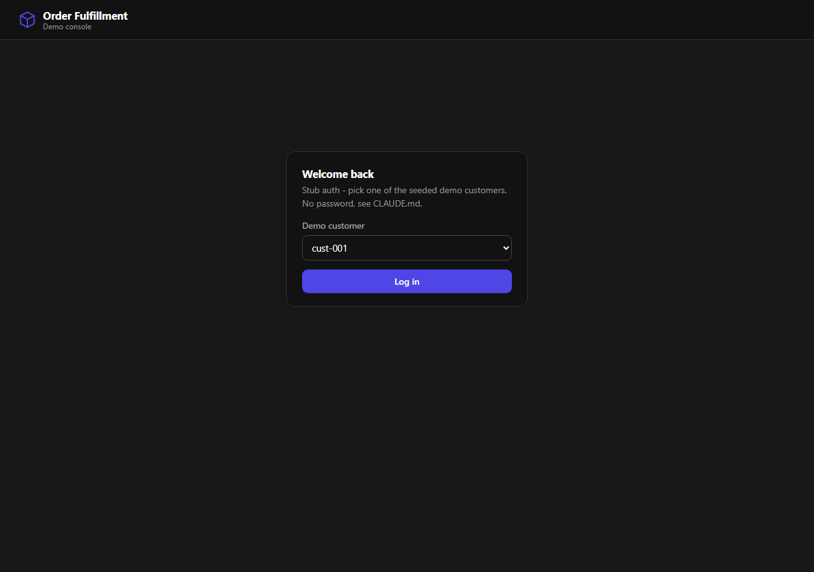
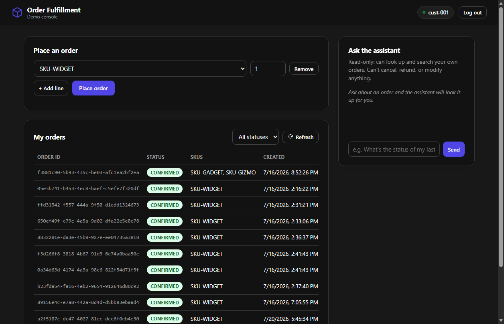
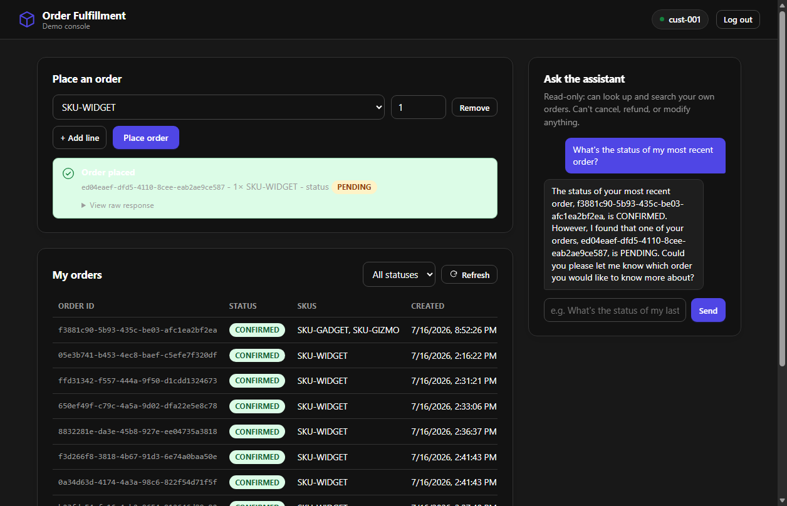
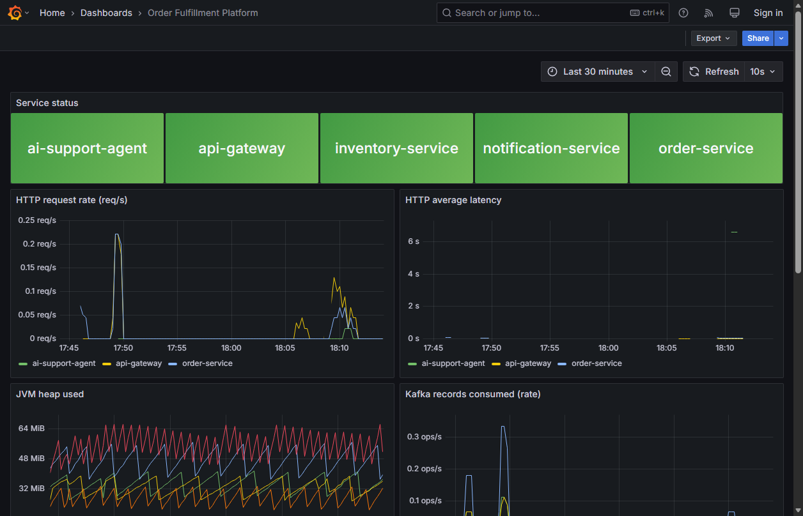
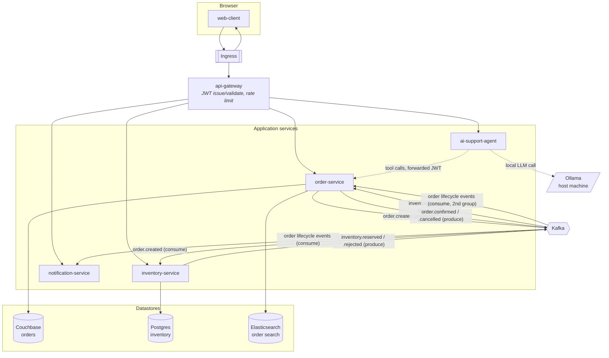

# Order Fulfillment Platform

An event-driven order fulfillment system — order intake → inventory reservation → fulfillment
notification — built as a portfolio project to demonstrate backend depth (Kafka, polyglot
persistence, Kubernetes, service mesh) alongside current AI-tooling fluency. It mirrors the *shape*
of a real production order-fulfillment system without reusing any employer-specific code, schemas,
or domain internals.

See [`DECISIONS.md`](DECISIONS.md) for the architecture decision records and
[`SECURITY.md`](SECURITY.md) for the security posture and scan results. [`CLAUDE.md`](CLAUDE.md) is
the running engineering log — every non-obvious gotcha hit while building this is documented there,
not just the parts that worked on the first try.

## Demo

A ~70-second walkthrough recorded straight off the running minikube deployment — real login, a real
order going through the Kafka pipeline to CONFIRMED, a real Ollama response from the AI assistant,
and the live Grafana dashboard:

https://github.com/user-attachments/assets/9b3584ce-35de-4760-96b0-334a033a5f0f

Screenshots below are from that same live run — real Kafka events, real Ollama responses, real
Prometheus metrics, not mocked data.

**Login** — a stub auth screen backed by 5 seeded demo customers (no password; see `CLAUDE.md` for
why that's called out explicitly rather than faked as more than it is):



**Order history** — every order this customer has placed, backed by the Elasticsearch-indexed
search endpoint (`GET /orders/search`, scoped to the authenticated JWT's customer, never a
client-supplied ID):



**Placing an order, then asking the AI assistant about it** — the order goes through the full
`order.created → inventory.reserved → order.confirmed` Kafka flow in the background; the assistant
(a local Ollama model, tool-calling into order-service, scoped to the caller's own orders only)
correctly distinguishes between the two orders it looked up:



**Grafana dashboard** — Prometheus scraping all 5 services' `/actuator/prometheus` endpoints,
visualized via a declaratively-provisioned dashboard (service status, HTTP rate/latency, JVM heap,
Kafka consumption):



## Architecture



Every produce arrow into Kafka is a transactional-outbox write (two different implementations,
deliberately — see `DECISIONS.md` ADR 3), not a direct produce from request-handling code.
order-service consumes its own lifecycle events a second time, in a dedicated consumer group, purely
to keep the Elasticsearch read model in sync — that's the CQRS-lite piece, and it's why the diagram
shows order-service both producing and consuming.

In the deployed cluster, every one of these hops is also mutually authenticated over mTLS (Linkerd)
and restricted by both an identity-based `AuthorizationPolicy` and a label-based `NetworkPolicy` —
see the "Kubernetes deployment" and "Service mesh" sections of `CLAUDE.md` for the full topology,
including which CNI actually enforces `NetworkPolicy` on this cluster and why that took two attempts.

## What's demonstrated here

- **Event-driven architecture**: Kafka as the backbone between order intake, inventory reservation,
  and notification, with idempotent consumers (Kafka is at-least-once) and two different
  transactional-outbox implementations compared side by side.
- **Polyglot persistence**: Couchbase (order documents, multi-document ACID transactions), Postgres
  (inventory counts, optimistic locking to prevent overselling under concurrency), Elasticsearch
  (search/audit) — each used for what it's actually good at, not decoration.
- **AI tool-calling with a real security boundary**: the AI support agent's tools are scoped to the
  authenticated caller's identity server-side (`OrderTools`, constructed per-request), not by
  prompting the model to behave — verified with an explicit cross-customer-leak test.
- **JWT auth with defense in depth**: api-gateway is the only issuer; two downstream services
  independently re-validate the same token rather than trusting a forwarded header.
- **Service mesh mTLS + genuinely enforced NetworkPolicy** (Linkerd + Cilium on minikube) — both
  layers verified live, not just applied and assumed working; the identity-based mesh layer
  auto-generates traffic denial for anything not explicitly authorized, and switching to a CNI that
  actually enforces `NetworkPolicy` immediately surfaced and let us fix a real policy gap.
- **58 unit tests** across the logic-heavy classes (outbox writers/relays, inventory reservation with
  optimistic-lock retry, JWT issuance, the AI agent's ownership filter, every `GlobalExceptionHandler`).
- **Dependency and container scanning** (OWASP Dependency-Check, Trivy) wired into the build, with
  two real Critical CVEs found and fixed during development — see `SECURITY.md`.
- **Non-root, least-privilege containers**: explicit Kubernetes `securityContext` on every workload
  (`runAsNonRoot`, `readOnlyRootFilesystem`, dropped capabilities where the underlying image
  supports it), not just an implicit `USER` in the Dockerfile.

## Tech stack

Java 21 · Spring Boot 3.5 · Spring Cloud Gateway · Spring AI (Ollama) · Kafka · Couchbase · Postgres
· Elasticsearch · Kubernetes (minikube) · Linkerd · Cilium · Maven multi-module · JUnit 5 / Mockito ·
plain HTML/CSS/JS web client (no build step)

## Repository layout

```
order-fulfillment-platform/
  api-gateway/            JWT issuance/validation, routing, rate limiting
  order-service/          Order lifecycle, Couchbase-backed outbox, ES search indexer
  inventory-service/      Stock reservation, Postgres-backed outbox
  notification-service/   Reacts to order lifecycle events
  ai-support-agent/       Spring AI + local Ollama, scoped read-only order lookup
  events-common/          Shared Kafka event records
  web-client/             Static demo UI - no build step, no framework
  infra/
    docker-compose.yml    Kafka, Couchbase, Postgres, Elasticsearch for local dev
    k8s/base/              Kustomize base manifests (registry-agnostic)
    k8s/overlays/minikube/ minikube-specific patches (imagePullPolicy: Never)
  security-reports/       Trivy scan output referenced by SECURITY.md
  DECISIONS.md            Architecture decision records
  SECURITY.md             Security posture, scan results, known gaps
  CLAUDE.md               Engineering log - architecture detail and every gotcha hit
```

## Running it locally (docker-compose)

Requires Java 21 and Maven on `PATH` (see `CLAUDE.md`'s Commands section if you need to point
`JAVA_HOME` at a specific install), plus Docker and a local Ollama install with a tool-calling model
pulled (`ollama pull llama3.2:3b`, or set `OLLAMA_MODEL` to something else already pulled).

```sh
# infra: Kafka, Couchbase, Postgres, Elasticsearch
docker compose -f infra/docker-compose.yml up -d

# one-time: JWT signing key pair (gitignored, never committed)
sh infra/generate-jwt-keys.sh

# build the reactor
mvn -DskipTests install

# run each service (separate terminals), from the repo root so the
# relative JWT key path resolves correctly
mvn -pl api-gateway spring-boot:run
mvn -pl order-service spring-boot:run
mvn -pl inventory-service spring-boot:run
mvn -pl notification-service spring-boot:run
mvn -pl ai-support-agent spring-boot:run

# serve the web client
python -m http.server 8085 --directory web-client
```

Then open `http://localhost:8085` and log in as any of `cust-001` through `cust-005` (stub auth, no
password — see `CLAUDE.md` for why).

## Running it on Kubernetes (minikube)

```sh
minikube start --cpus=4 --memory=7200mb --driver=docker --cni=cilium
minikube addons enable ingress

# Linkerd (mTLS + AuthorizationPolicy) - see CLAUDE.md's Linkerd section
# for the Gateway API CRD prerequisite and the exact install flags this
# needs on minikube's docker driver
linkerd install --crds | kubectl apply -f -
linkerd install --set proxyInit.runAsRoot=true | kubectl apply -f -

# build all 6 images into minikube's own docker daemon
eval $(minikube docker-env)
docker build --target api-gateway -t order-platform/api-gateway:local .
docker build --target order-service -t order-platform/order-service:local .
docker build --target inventory-service -t order-platform/inventory-service:local .
docker build --target notification-service -t order-platform/notification-service:local .
docker build --target ai-support-agent -t order-platform/ai-support-agent:local .
docker build -t order-platform/web-client:local web-client/

sh infra/k8s/create-secrets.sh
kubectl apply -k infra/k8s/overlays/minikube
```

Then reach it via `kubectl port-forward -n ingress-nginx svc/ingress-nginx-controller 18080:80` and
either add `order-platform.local` to your hosts file or use `curl --resolve` — see `CLAUDE.md`'s
Kubernetes deployment section for the full verification sequence (login → order → Kafka settlement
→ search → AI assistant).

## Tests and CI

```sh
mvn test                          # unit tests, all modules
mvn -pl <module> -am test         # a single module
```

GitHub Actions (`.github/workflows/ci.yml`) runs the build and unit test suite plus a Docker build
of every service image on every push. OWASP Dependency-Check runs as a separate, optional job gated
on an `NVD_API_KEY` secret being configured — its first-run NVD sync without a key was slow enough
in practice (over an hour) to make it impractical as a required check on every push; see
`SECURITY.md` for why and how it's still run.
